# 泰拉瑞亚:

### 《泰拉瑞亚》是由Re-Logic公司开发的一款高自由度的沙盒游戏，于2011年5月16日在PC上发行。

#### 玩家可以在游戏中做很多事情：制造武器战胜各种各样的敌人及群落；挖掘地下寻找器材配件、金钱和其他有用的东西；收集木材，石材，矿石等资源；用世界里的一切创造你需要的东西并守护它。

 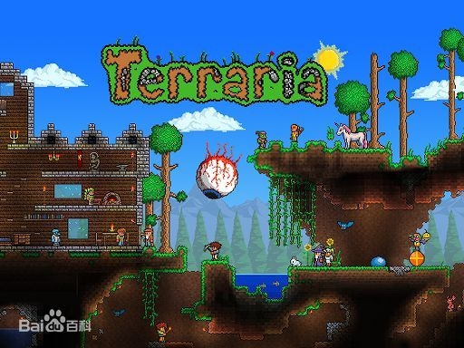

## 游戏背景：

​		在完成角色自定义后，游戏就把玩家扔进了一个完全随机生成的像素世界)中，手头的工具意味着玩家需要造东西、探索世界并打败怪物。

​		整个游戏世界都是可破坏的，破坏某些障碍物后，就可以找到各种资源比如石头、木材、铁矿或者其他装备，当然，在不断深入的同时，也会遇到各种怪物。游戏的主要任务就是让玩家利用各种资源按自己的想法创造出各种稀奇古怪的东西，所以这就让玩家充满了探索的动力。

​    	地面生活有日夜交替。在早晨，玩家可以到处乱跑也可以建造各种庇护所等等；而当夜幕降临后，僵尸和各种眼球怪就会出现，要么杀死他们，要么就逃走。

​		地面惬意的生活让人流连忘返。但是，黑暗的地下才是真正刺激的地方。一些必需品玩家可以在地表找到，但稀有的材料只会出现在地下。地下世界就像是一部传统的2D动作游戏。从巨型史莱姆、骷髅、蠕虫到各种虫子，相当丰富多彩。

​		如果说地面的重点在于建造和探索，那么地下就是玩家战斗的地方。

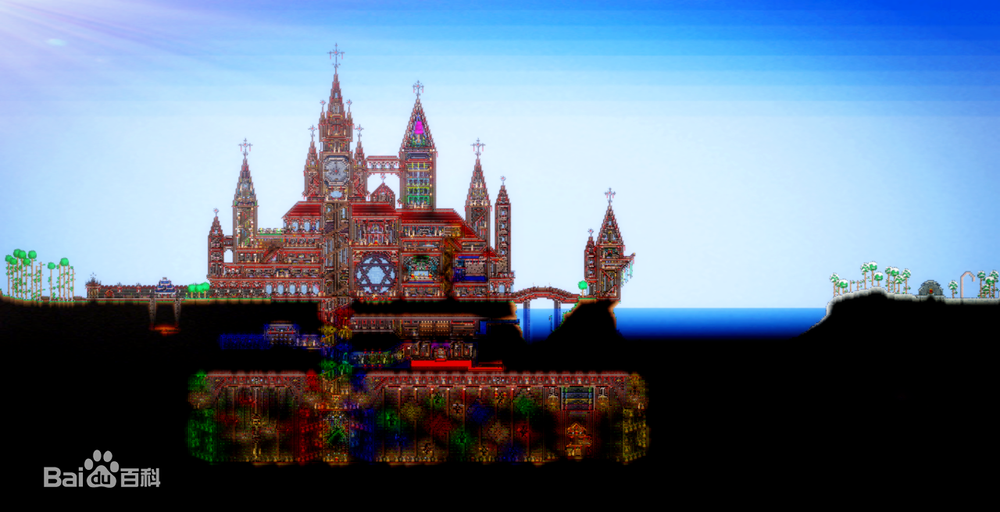

## 主角设定：

​		游戏开始之初，为玩家提供了设定游戏主角的机会。玩家可以自定义游戏主角的性别，以及头发，眼睛，皮肤和衣服的颜色。

​		不论玩家设定主角何种的外貌，进入游戏之后都拥有相同的初始属性，即：HP100，防御0，物品栏则是同样的铜质短剑，铜质镐子和铜质斧头。

### Boss：

​		游戏中大多数boss都可以被特定的合成物品或者掉落物品召唤出来，以方便玩家随时挑战boss。

​		值得一提的是血肉之墙，血肉之墙是游戏进程前期和后期的分界点。当玩家击败血肉之墙之后游戏会变得更加困难（也就是常说的肉山后）。血腥/腐蚀化的出现可能使玩家失去NPC，大量新增的怪物会阻碍玩家探索的脚步，而新三矿的出现也为玩家提供了提升自身装备的台阶，让玩家以更强大的属性去对抗新出现的boss，迎接新的挑战。

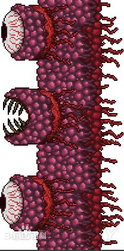

### NPC设定:

​		游戏中玩家虽然可以随意建造属于自己特色的建筑，但是可以被NPC认可的“家”却必须要满足特定条件：

​		首先，必须用砖块砌成最低高度总共6格，宽度总共10格，即使用空间至少为4x8大小的完全封闭的空间，包括背景墙壁。泥土材料（Dirt）在任何情况下都不会被认可。其次，对于背景墙壁来说，允许开一个适当的小口来当做窗户；对于地板来说，木质平台（WoodenPlatform）不可超过总地板面积的50%。最后，必须至少有一张桌子或工作台（Workbench），一把椅子，一个门（不可与其他NPC共用）和一个可放置的静态光源。

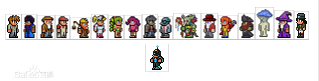

### 装备:

​		 在泰拉瑞亚之中，玩家本身并没有职业之分，但是通过防具的属性加成变相的区分了玩家。 

​		《泰拉瑞亚》中所有的武器和饰品在被制造出后、从NPC处买来后、在箱子中生成时或掉落时都会随机产生前缀（或后缀）。在游戏中也是通过装备前缀文字来表现装备的品级和稀有度（颜色）。玩家可以通过在哥布林工匠处重铸从而改变装备的前缀（稀有度），同时装备的属性颜色也会随之更改。

​		从普通到神器的装备品级排序为：灰色，白色，蓝色，绿色，橙色，红色，品红，紫色，淡绿，黄色，青色。

​		饰品重铸可以增加防御、移速、最大法力值。武器重铸影响有正面有负面。最多5个正面效果或3个负面效果。游戏中总共有112种前缀在重铸时随机出现。

### 消耗品：

​		游戏中药剂大多数由宝箱中获得，也可以通过合成获得。药剂除了给玩家提供HP、MP的回复之外，还提供诸如反重力，免疫特定伤害，显示矿物分布，增加怪物刷新频率，召唤照明和水下呼吸等功能。 另有一些消耗品是用于召唤boss所用，例如巫毒人偶，邪恶的眼球等。

### 物品合成：

​		游戏中很多极品道具都不是产自地下的宝箱或者boss所掉落的，很多东西都需要玩家在特定的地方用特定的材料来合成。

​		比如游戏中武器泰拉之刃的合成，就需要玩家先用血腥屠杀者/光之驱逐、熔岩巨剑、妖刀村正和草薙四把武器在恶魔（血腥）祭坛合成永夜之刃，再用永夜之刃和日食时击杀特定怪物掉落的英雄断剑合成真·永夜之刃，然后使用神圣锭制作的圣剑与英雄断剑合成真·神圣之剑，最后用真·永夜之刃、真·神圣之剑再加一把英雄断剑合成才能获得泰拉之刃（总共需要3把英雄断剑）。

## 场景地图：

####  山地：

有平坦，有凸起；背景高山、或者树林；一般地表长有：草皮，花草，一些药材植物，普通树木有天然形成山洞，有一些陶罐，打碎后能获取物品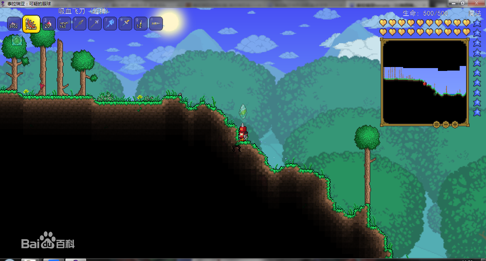

####  雪地 :

大致生成在出生地地形的旁边,背景雪地树林或雪山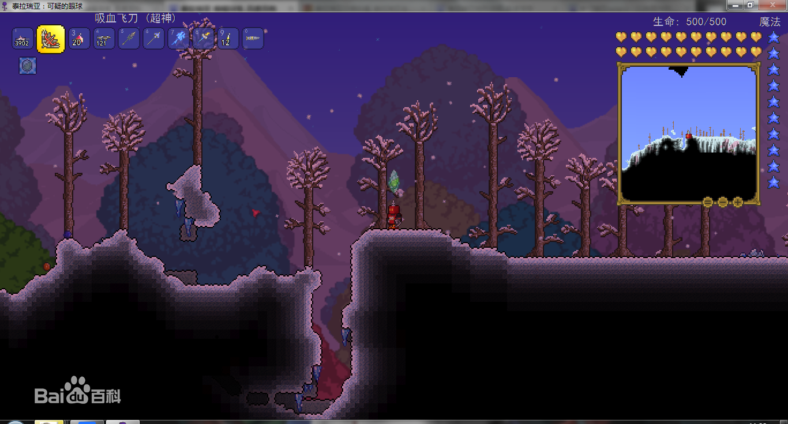

####  沙漠 :

由流沙构成，受重力影响，可能会出现沙漠金字塔和蚁穴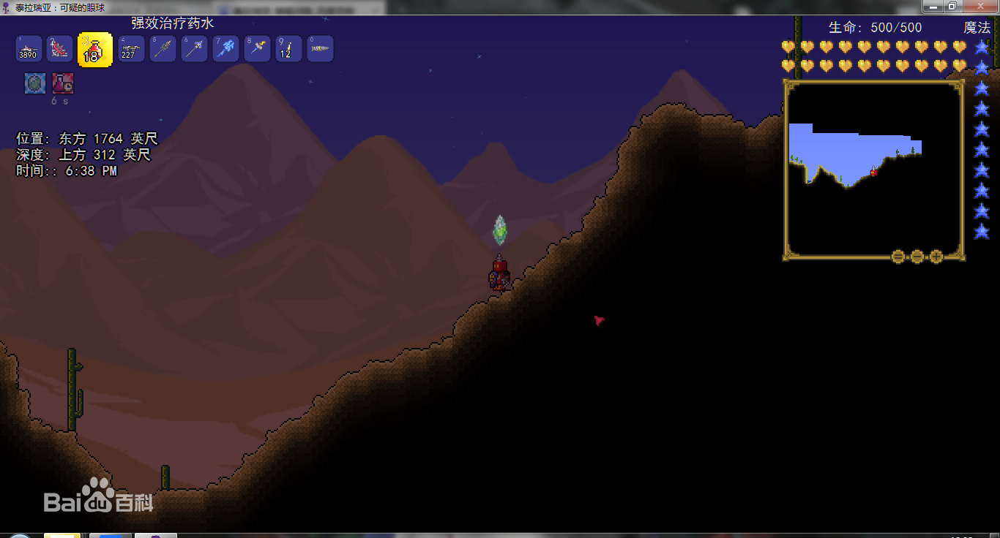

####  丛林 :

 水较多，各种水生动物，地下可能有蜂巢和神庙 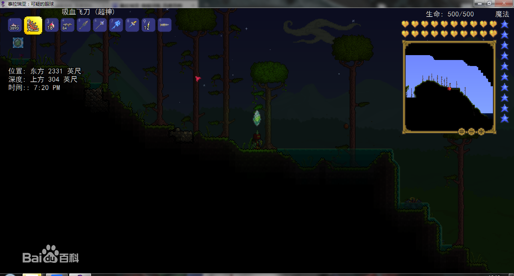

####  海洋 :

 大型鱼类，水下有宝箱 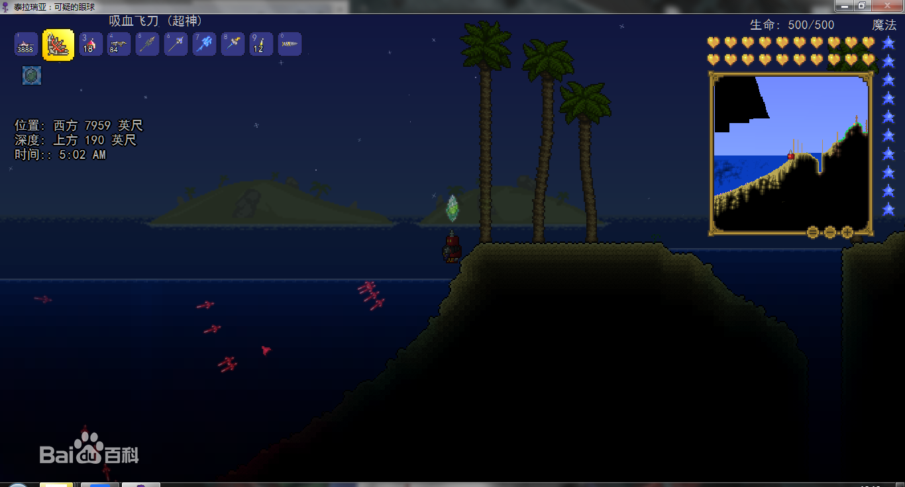

####  夜光蘑菇繁殖地 :

地下随机出现，大量夜光蘑菇，里面可以找到松露虫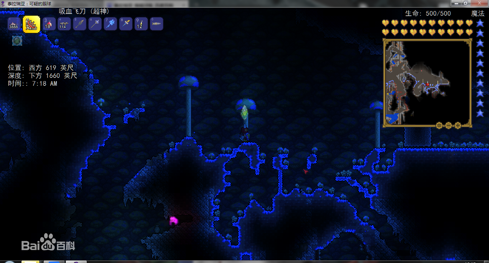

####  地狱 :

在地图最下缘，岩浆遍布，也是与boss血肉之墙战斗的地方，暗影宝箱里可以找到许多好东西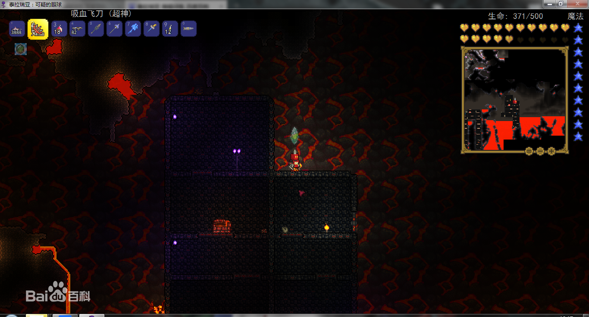

####  腐蚀之地 :

背景昏暗，紫色,井字形地貌，足以摔死新手玩家;击破三个腐蚀之地下的暗影之球即可召唤boss世界吞噬者,在正常的情况下不与血腥之地同时出现的一张地图中

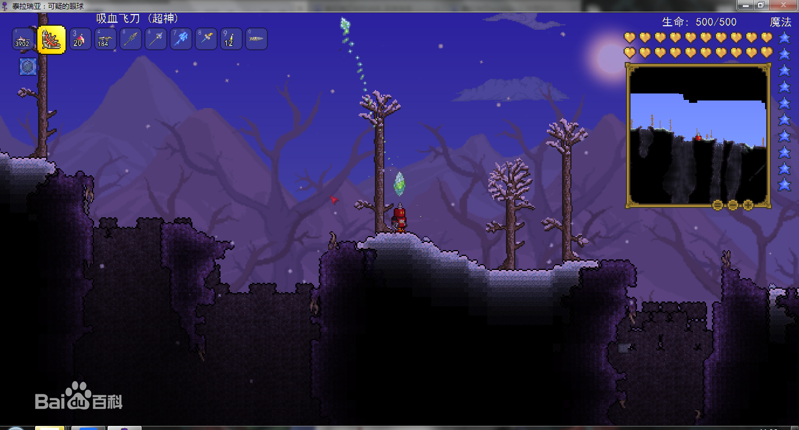

####  血腥之地 :

背景昏暗，红色,入口较长，形状像一之手。击破三个血腥之地的血腥之球即可召唤boss克苏鲁之脑

在正常的情况下不与腐蚀之地同时出现的一张地图中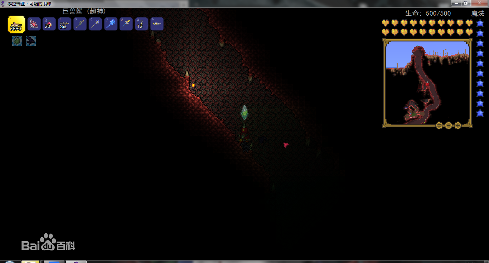

####  神圣之地：

打败血肉之墙之后随机出现的地貌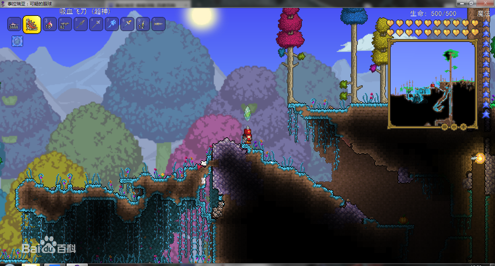

